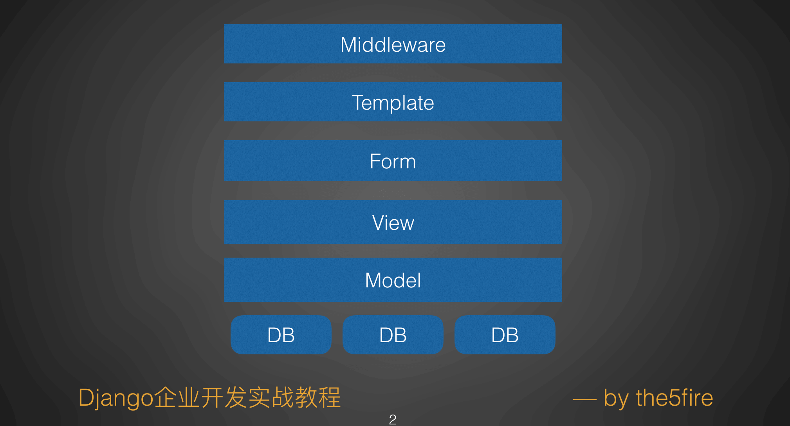

# 如何阅读Django文档

通过文字的方式来描述似乎不是件容易的事，我尽量通过文字表达清楚。

## 文档结构

Django是基于MVC模式的框架，虽然也被称为“MTV”的模式，但是大同小异。对我们来说，需要了解的是无论是MVC模式还是MTV模式，甚至是其他的什么模式，都是为了解耦。把一个软件系统划分为一层一层的结构，让每一层的逻辑更加纯粹，便于开发人员维护。

基于这点儿认识，我们可以来看下Django的文档。

从大的划分上来说，Django的文档先是分出了这么几个模块：The model layer, The view layer, The template layer, Forms, 剩下的部分都是功能文档，比如Pagination，Caching等，可以贯穿所有层。

而每个模块或者说层，又分为了不同的模块，我们简要的把常用的模块介绍一下。

### Model部分

Model在整个项目结构中是直接同数据库打交道的层，所以数据处理的部分都在这一层。在业务开发中，关于纯数据操作的部分，建议都放到这一层来做。

* Models - 模型定义相关的使用说明，字段类型，Meta配置
* QuerySets - 在Model的基础上，你要怎么通过Model来查数据，有哪些接口可以用，比如`all()`, `filter()`等，以及更进一步的定制，毕竟ORM在查询上会有一些限制，但是在这一部分你可以找到如何自定义查询。
* Model instances - Model的实例，一个实例你可以理解为表中的一条记录，这个实例有哪些操作，如何修改表的数据，都在这了。
* Migrations - 主要是在开发阶段，我们可能会不断的调整表的结构，这个就是用来做表结构调整的。理论上我们只需要知道两个命令:`makemigrations`和`migrate`就行了，但是如果你想做更多的了解，可以仔细看下这部分。
* Advanced - 高级部分（别被`高级`这两字吓到），如何自定义Manager（也就是常用的Model.objects.all()中的objects），以及如果不爽ORM的查询限制，但是又想用到ORM对象的映射，你可以考虑的RAW_SQL。另外关于事务、聚合、搜索，以及多数据库支持等更多的关于Model层的需求都可以看着。 
* Other - 这一部分有两块，建议一定要看看，一个是`Legacy databases(遗留数据库)`，想象下，有人甩给你一个已有的CMS项目，要改成Django的，你拿到表，直接根据生成Model。之后你再花几分钟写写admin部分代码，CMS出来了，爽不爽。另外一部分就是`Optimize database access `，一定要看！避免你踩坑。如果不想看英文，可以到我博客看中文翻译，虽然版本较老，但是依然适用:[翻译了Django1.4数据库访问优化部分](https://www.the5fire.com/django-database-access-optimization.html)

### View部分

在View中，我们通过操作Model拿到数据，做一些业务上调整，然后把数据传递到模板中，最终渲染出来页面。

在Django的文档中，View部分包含了URL配置、http request、http response以及处理请求的View函数和类级的View等部分。下面我们一一列举。

* The basics - URL配置，view方法，以及常用装饰器，比如想给这个接口增加缓存、或者要增加限制（只允许GET请求）等。
* Reference - 一些参考，内置的view（比如静态文件处理，404页面处理等），Request和Response对象介绍，TemplateResponse对象介绍。
* File uploads - 文件上传是Web开发中常遇到的问题，Django中可以通过这一节来看如何处理文件上传，它提供了一些内置的模块来帮你处理上传上来的文件，不过它也会告诉你如何来自定义后端存储。
* Class-based views - 这部分可以理解为更复杂的View函数，只不过这儿是类。通过类可以提供更好的复用，从而避免自己要写很多代码。当你发现你的View中有太多的业务代码时，你可以考虑参考这一节把代码改造为ClassBase View（简称:CBV），如果你的代码中有很多类似的View函数，可以考虑这么做。这部分的文档就是告诉你Django中，如何来更好的构建你的View，以及复用你的View。
* Advanced - 更高级的部分，就是告诉你如何把数据导出为CSV或者PDF，冠名为`更高级`可能是因为用的少。（瞧，`高级`没什么难的）
* Middleware - 中间件（中间层），无论怎么翻译，你得理解它的作用，这一部分代码作用于WSGI（或者Socket连接）和View之间，还记得我们第二章讲的WSGI中间件的部分吗，一样的逻辑，还是对View函数做了一个包装，但是稍微复杂了一些。Django中安全的部分，Session的部分，整站缓存的部分，都在这一块了。

### Template部分

这是Django声称对设计师友好的部分，因为它提供的语法很简单，任何人都可以很快上手，即便是不同编程的人，也可以很容易学习和使用。

* The basics - 这部分介绍了Django模板的基本配置，以及基本的模板语法，还有看起来可配置的如何替换为jinja2模板引擎的说明。
* For designers - 说是给设计师看的，但是你也应该看一看，基础的控制语句、注释，还有内置的filter和tag，还有最重要的针对用户友好的数字的展示。
* For programmers - 这个程序员更应该看看了，如何传递数据到模板中，如何配置模板，以至于能够在view中更好的渲染模板，还有就是如何对现有模板所提供的简单的功能最更多的定制。

### Forms部分

对于传统的，需要通过form来提交数据的页面，Form还是挺好用的。就像是ORM（关于ORM是什么不清楚的可以看:[什么是ORM？](https://www.the5fire.com/what-is-orm.html)）一样。Form是对html中Form表单的抽象。在下面几节中我们会稍加演示。

* The basics - 基础的API的介绍，里面有类似于Model的Field的部分，还有组件（Widgets）的部分。
* Advanced - 更丰富的使用，如何把Form同Model结合(Model也有Field，Form也有Field，用一个不行？），以及如何把媒体资源渲染到页面上呢，如果form足够好用，其实我们不需要更多的操作模板了不是吗。还有如何布局你的字段，一行展示一个还是一行展示多个，还有更加细节、深入的部分就是如何定义字段级别的验证功能。比如页面上只允许输入数字的地方如何验证。

这部分在开发admin时很常用，因为admin跟Model结合紧密，我们如果需要去改模板的话成本会有点高，所以更好的做法是通过自定义Form以及自定义Widget来实现我们需要的功能。在前台（针对用户的界面）以为我们直接写的模板，所以更加灵活，并且我们也很少使用form表单来提交数据，所以用的较少。

### 剩余的部分

其他部分并没有太多的内容，都是单独的Topic，通过简单的单词，很好识别，比如admin，caching等。在文字中我就不再描述。

## 总结

Django文档是个好东西，不过有一部分的文档Django始终没有补充上，那就是admin的部分。所以这就涉及到另外一个话题，看文档还是看代码，admin的部分，如果有较多的需求，建议看完文档，然后就去摸索代码。如果你熟悉了前面介绍的几个层，那admin的代码对你来说也不是什么难事儿。

除了admin的部分，其他的文档上基本都有。不过也没有必要像被字典一样的去看文档，有空搂一眼，遇到问题搂一眼，随着实践越来越多，对文档会越来越熟悉，但是依赖会越来越少。Django的代码结构跟文档一样划分清晰，所以the5fire现在大部分的问题都是靠读代码来解决。

最后需要提到一点的是，无论是Django文档，还是其他问题，甚至是这本书，都是仅供参考。正确的答案始终是在你电脑上的代码里。无论是因为，框架版本的原因，还是文档上的书写错误，或者是本书的书写错误，你电脑上的代码始终不会骗你。
